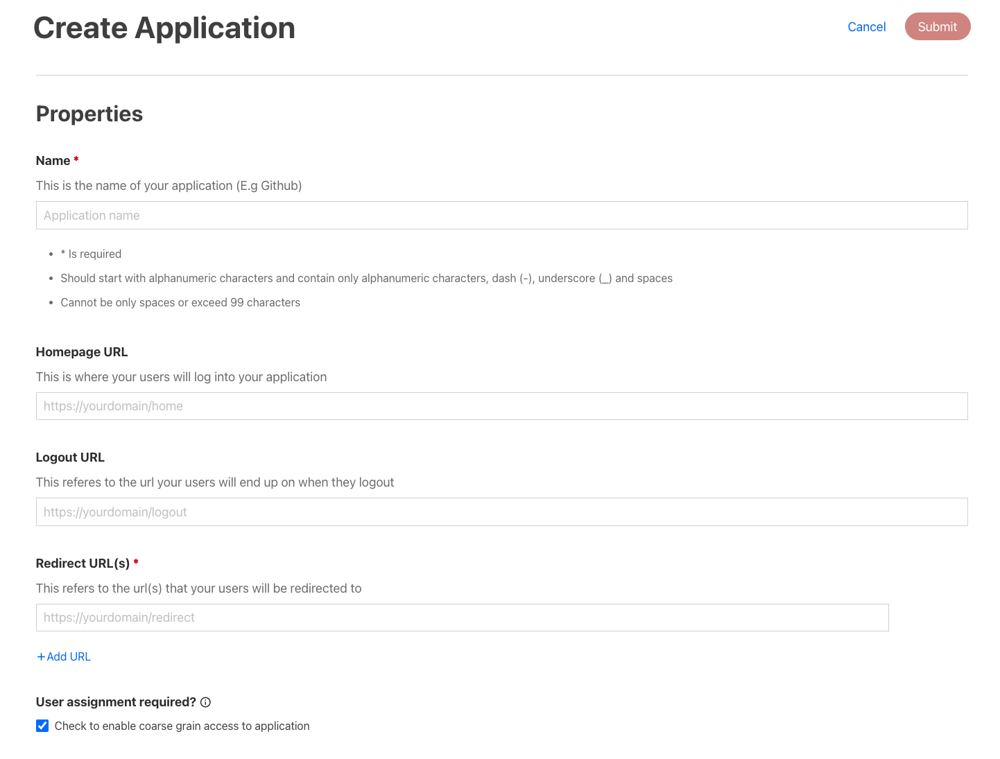

# Client Applications

## Overview
Client applications (or client apps) are namespace objects that represent a single tenant service that is integrated with TechPass AAD. Client Apps describes the tenant service to TechPass AAD and contains properties that define how TechPass AAD should interact with them. 

## Properties
?> Some of these properties will only appear after the Client App has been created.

### Application ID
The ID of the Client App. This is used to identify your tenant service to TechPass AAD during a HTTP request.

### Directory ID
The directory ID of TechPass AAD tenant with Microsoft's Azure AD SaaS. This allows the authentication endpoints to identify that the requests should be directed to TechPass AAD.

### Owners
A list of users that are has the permission to make changes to the Client App properties, which should typically be the administrators of the Tenant Namespace.

### Name*
An unique app name to identify your service on TechPass.

### Homepage URL
The landing page of your application where your users will use to login.

### Logout URL
You can specify a URL to redirect your users to after they have successfully logged out from your app.

### Redirect URL*
After successfully authenticating your users, you will want your users to be redirected by to your app. You will need to provide 1 or more valid URLs to redirect your user to. This should be a user routable URL.

TechPass AAD will validate the `redirect_uri` parameter in all authorize HTTP requests for the app. If the value of the parameter does not match any of the URLs in this list. The authorisation request will fail.

- To add more URLs, click on '*+ Add URL*' and enter the URL in the new text field that appears. 
- To remove an existing URL, just click on the thrash bin on the right of the URL that you want to remove.
- Remember to click the Update button at the top if you are editing the URLs for an existing app.

?> More information on Redirect URLs, can be found [here](https://docs.microsoft.com/en-us/azure/active-directory/develop/reply-url).

### Enable Sign In
Unchecking this field will disable ALL user sign in to the tenant service.

### User Assignment Required
This properties determines if a user needs to be granted access before he/she is allowed to sign into your app. Leaving this field uncheck means that **ALL** TechPass users will be able to sign into your app.

!> Careful consideration is required if you wish the alter the value of this field. Find out more about to how design your [Access Model](resources#concepts) with TechPass.

If you left this field checked, you will need to grant access to users that you want to allow into your app. See [Assigning Access to your App](#assigning-access-to-your-app) for more info.

### Implicit Grant
Implicit grant is less secure than other grant flows and disabled by default. 

To enable implicit grant, check the corresponding boxes to allow an Access Token or ID Token or both to be issued in an implicit grant flow.

!> If you do not use implicit grant, please keep the boxes unchecked.

?> More information regarding Implicit Grant is available [here](https://docs.microsoft.com/en-us/azure/active-directory/develop/v2-oauth2-implicit-grant-flow).

### Client Secrets
The secret key is used by tenant services to authenticate itself to TechPass AAD. Each secret key is only valid for a period of one year once created. 

### Assigned Users and Groups
A list of users and/or user groups that has been granted permission to sign in to your tenant service. If you add a user group, ALL users within that group will be granted permission. 

## Registering a Client App
1. On the applications tab within a namespace, click on the '***+ Create***' button.
2. Fill up the required information marked with '*' and click ***Submit***.

## Managing Access to your App
If you did not disable [User Assignment Required](user-assignment-required) option, TechPass users will not be able to sign in to your app unless they are authorized (or assigned). 

#### Adding a User or Group
1. In the Assign Role section, click on '+'.
2. Key in the a search phrase to locate the user or group.
3. Click on the '+' sign on the right of the user/group. It should then appear on the *Selected Groups/Users* list.
4. Click on ***Update***. 

### Removing a User or Group 
