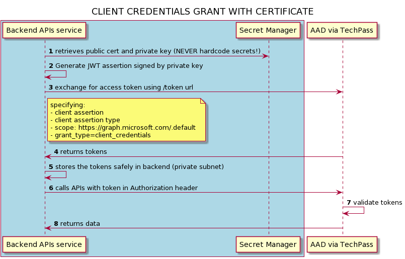

# Identity Provider and OAuth 2.0 in TechPass

## What is Oauth 2.0?
OAuth 2.0 is the industry-standard protocol for authorization. 
OAuth 2.0 focuses on client developer simplicity while providing specific authorization flows for web applications, desktop applications, mobile phones, and living room devices. 
This specification and its extensions are being developed within the IETF OAuth Working Group. - reference: https://oauth.net/2/

Introduction to Oauth 2.0 and OpenID connect

[](https://youtu.be/996OiexHze0 "Video Title")

## Microsoft Azure Active Directory as an Identity Provider
The Microsoft identity platform endpoint for identity-as-a-service implements authentication and authorization with the industry standard protocols OpenID Connect (OIDC) and OAuth 2.0, respectively. 
While the service is standards-compliant, there can be subtle differences between any two implementations of these protocols. - reference: https://docs.microsoft.com/en-us/azure/active-directory/develop/active-directory-v2-protocols

### Supported Grant Types
TechPass will be support 2 grant types of OAuth 2.0, namely:

* Auth Code Flow with Proof Key for Code Exchange (PKCE)
* Client Credentials Grant (with secret or certificate)

## Auth Code Flow with Proof Key for Code Exchange (PKCE)
The OAuth 2.0 authorization code grant can be used in apps that are installed on a device to gain access to protected resources, such as web APIs.

It's used to perform authentication and authorization in the majority of app types, including [single page apps](https://docs.microsoft.com/en-us/azure/active-directory/develop/v2-app-types#single-page-apps-javascript), 
[web apps](https://docs.microsoft.com/en-us/azure/active-directory/develop/v2-app-types#web-apps), and [natively installed apps](https://docs.microsoft.com/en-us/azure/active-directory/develop/v2-app-types#mobile-and-native-apps). 
The flow enables apps to securely acquire access_tokens that can be used to access resources secured by the Microsoft identity platform endpoint, as well as refresh tokens to get additional access_tokens, and ID tokens for the signed in user. - reference: https://docs.microsoft.com/en-us/azure/active-directory/develop/v2-oauth2-auth-code-flow

**Tokens Issued:** ID, Access and Refresh

There will be 4 parties involved in the sign in exchange using Auth Code Grant flow. User, your application/web portal frontend and backend, AzureAD via TechPass.

### Generating a code verifier and code challenge
The first thing your app must do before starting an authorization request is generate a “code verifier”. A code verifier is a random string between 43 and 128 characters long that consists of the characters A-Z, a-z, 0-9, and the punctuation -._~ (hyphen, period, underscore, and tilde).

The “code challenge” is created by performing a SHA256 hash on the code verifier and then Base64url encoding the hash e.g.
```
code_challenge = BASE64URL-ENCODE(SHA256(ASCII(code_verifier)))
```


Next: Follow through instructions in this [article](/concepts/authcodegrant) on how to integrate your application/web portal to enable TechPass's Single-Sign-On via Auth Code Grant flow.

## Client Credentials Grant 
You can use the [OAuth 2.0 client credentials grant](https://tools.ietf.org/html/rfc6749#section-4.4) specified in RFC 6749, sometimes called two-legged OAuth, to access web-hosted resources by using the identity of an application. 
This type of grant is commonly used for server-to-server interactions that must run in the background, without immediate interaction with a user. These types of applications are often referred to as daemons or service accounts. - reference: https://docs.microsoft.com/en-us/azure/active-directory/develop/v2-oauth2-client-creds-grant-flow

### Client Credentials Grant with Secret
There are 3 parts to establishing this flow:

1. Adding permissions to the client application (No action on your part. It's taken care by TechPass)
2. Creating client secret for your application
3. Exchanging of token using client secret

**Tokens Issued:** Access

2 parties involved in the sign in exchange using Client Credentials Grant flow. Your application/web portal backend (safely secure within a private subnet) and AzureAD via TechPass.


Next: Follow through instructions in this [article](/concepts/clientcred) on how to create client secret and using it to exchange for tokens using Client Credentials Grant flow with secrets.

### Client Credentials Grant with Certificate (recommended by CSG)
There are 3 parts to establishing this flow:

1. Obtain a certificate issued by CoreSG (WOG CA??) or public CA (eg. let's encrypt or AWS certificate manager)
* **Note:** CSG recommends **1** year maximum for validity period. You will need to plan for rollover
* Keep your private key **secure**. Can consider using AWS Secret Manager but please be mindful of the secrets size limit (more info)
2. Adding permissions to the client application (No action on your part. It's taken care by TechPass)
3. Upload your public certificate to TechPass
4. Generate JWT assertion using your public cert and signed by private key
5. Exchanging of token using generated JWT assertion 
   
**Tokens Issued:** Access

2 parties involved in the sign in exchange using Client Credentials Grant flow. Your application/web portal backend (safely secure within a private subnet) and AzureAD via TechPass.



Next: Follow through instructions in this [article](clientcredentials) on how to upload client certificate and using it to exchange for tokens using Client Credentials Grant flow with certificate.
