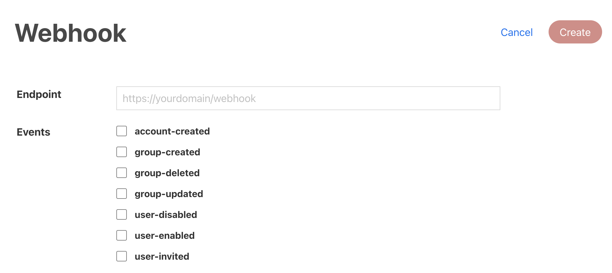

# Webhooks
## Overview
Webhooks are HTTP API endpoints that gets called whenever an event occurs on TechPass. The API endpoint must either be publicly routable or whitelisted to accept HTTPS network traffic from TechPass service.

You can get started with webhooks using the following steps:
1. [Create](#create) a webhook endpoint on your server.
2. [Register](#register) the endpoint in TechPass Integrations - Webhook.
3. Save the webhook secret and use it to [verify](#verify) TechPass issued HMAC signatures for every webhook event.

## Configuring your Webhooks <a id="create"></a>
### Verification and Registration
Webhooks will only be sent out to endpoints that have been verified and registered by TechPass backend. In order for TechPass backend to verify your webhook endpoint, you will first have to configure your webhook endpoint on your server.

### Verifying Webhook Endpoint
TechPass requires that the specified webhook endpoint belongs to you before it can register and save the endpoint to your tenant namespace.

To do this, when you create or update your webhook endpoint, TechPass backend will generate a random string as a token, and fire a GET request to your endpoint with a query parameter `challengeToken` for a verification request.

```HTTP
GET https://example.com/webhook?challengeToken=YJ_kmLqUz5QkZ9xra4jcnzn3xwczvul_tdoDztSZicQ=
```

We expect your endpoint to return the token in a JSON response body in the `challengeToken` field.

```JSON
{
  "challengeToken": "YJ_kmLqUz5QkZ9xra4jcnzn3xwczvul_tdoDztSZicQ="
}
```

#### Example code setup

<!-- tabs:start -->

#### ** Node **

```javascript
const express = require('express');
const app = express();
const PORT = process.env.PORT || 4321;

app.use(express.json({ limit: '10kb' }));

app.get('/webhook', (req, res) => {
  challengeResponse = req.query.challengeToken;

  res.setHeader('X-Content-Type-Options', 'nosniff');
  res.status(200).send({ 'challengeToken': challengeResponse });
});

app.listen(PORT, () => {
  console.log(`Express server started on port ${PORT}`)
});
```

<!-- tabs:end -->

### Registering your webhook <a id="register"></a>
Once you have your webhook endpoint configured on your server, you can register the endpoint in TechPass. From the Integrations page, under Webhook, click on Create.



1. Provide the exact HTTP URL to call.
2. Check the events that you would like to be notified for.
3. Click ***Create***.

You will receive a webhook secret upon a successful registration.

## Check Signatures <a id="verify"></a>
To prevent data tampering attacks, TechPass will sign the webhook payload with your webhook secret using HMAC-SHA256 to generate a hash, which will be included in a `X-TECHPASS-SIGNATURE` header of every webhook request sent to your endpoint.

After receiving the webhook event, your server must validate that the signature in `X-TECHPASS-SIGNATURE` from the headers, matches the signature hash that you compute from the webhook payload.

### Validating Signatures

You can compute and validate the signature using the following steps:

1. Receive the raw JSON payload body.
2. Compute a SHA256 HMAC for the payload, together with your webhook secret.
3. Compute the hex digest of the HMAC.
4. Compare your computed signature against the `X-TECHPASS-SIGNATURE`.

If the signatures do not match, the request should not be trusted and you should not process it.

#### Example code setup

<!-- tabs:start -->

#### ** Node **

```javascript
const express = require('express');
const crypto = require('crypto')
const dotenv = require('dotenv');
dotenv.config();

const app = express();
const PORT = process.env.PORT || 4321;

app.use(express.json({ limit: '10kb' }));

app.post('/webhook', (req, res) => {
  signature = req.headers['x-techpass-signature'];
  secret = process.env.WEBHOOK_SECRET;

  // compute and verify hmac hash
  computed = crypto.createHmac("sha256", secret).update(JSON.stringify(req.body)).digest('hex');
  valid = signature === computed

  if (valid) {
    // do whatever automation when webhook triggered
    res.status(200).send({
      msg: 'webhook received successfully',
      data: req.body
    })
  } else {
    // return 200 just to reply to webhook
    res.status(200).send()
  }
});

app.listen(PORT, () => {
  console.log(`Express server started on port ${PORT}`)
});
```

<!-- tabs:end -->

## Removing Webhook
Simply clear the webhook endpoint and un-check the events that are checked and click ***Update***.
